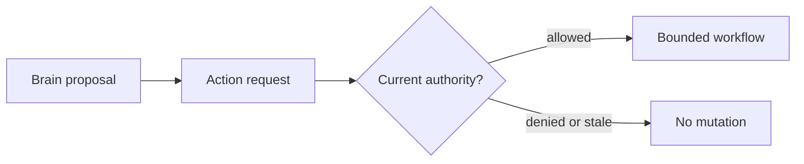

# Authority boundary diagram source

```text
evidence -> Brain proposal -> application request -> Control Plane decision
                                                    |
                                                    v
                                      bounded durable execution context

proposal != permission
workflow != permission
credential != ambient permission
```


