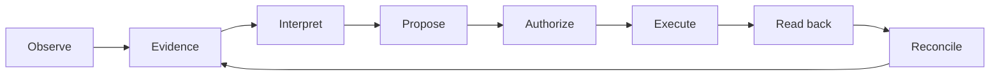

# Closed-loop diagram source

```mermaid
flowchart LR
  O[Observe] --> E[Evidence]
  E --> I[Interpret]
  I --> P[Propose]
  P --> A[Authorize]
  A --> X[Execute]
  X --> R[Read back]
  R --> C[Reconcile]
  C --> E
```

`Execute` has a provider receipt as an input to reconciliation, but is not itself an outcome.
