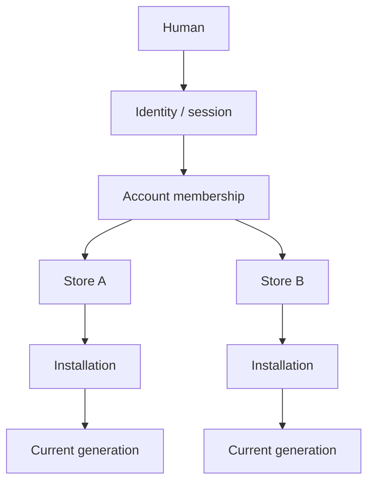

# Multi-tenant model diagram source


```mermaid
flowchart TD
  H[Human] --> S[Identity / session]
  S --> A[Account membership]
  A --> SA[Store A]
  A --> SB[Store B]
  SA --> IA[Installation]
  SB --> IB[Installation]
  IA --> GA[Current generation]
  IB --> GB[Current generation]
```

```text
human != store
account != every installation
installation != all generations
```
