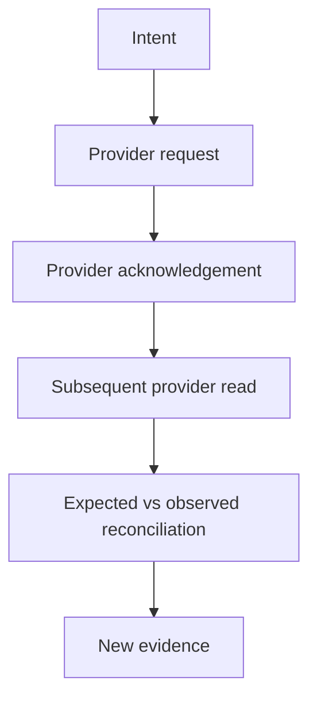

# Provider reconciliation diagram source

```mermaid
flowchart TD
  I[Intent] --> Q[Provider request]
  Q --> A[Provider acknowledgement]
  A --> R[Subsequent provider read]
  R --> C[Expected vs observed reconciliation]
  C --> E[New evidence]
```

Acknowledgement is a transport signal. Reconciliation is an outcome decision.
