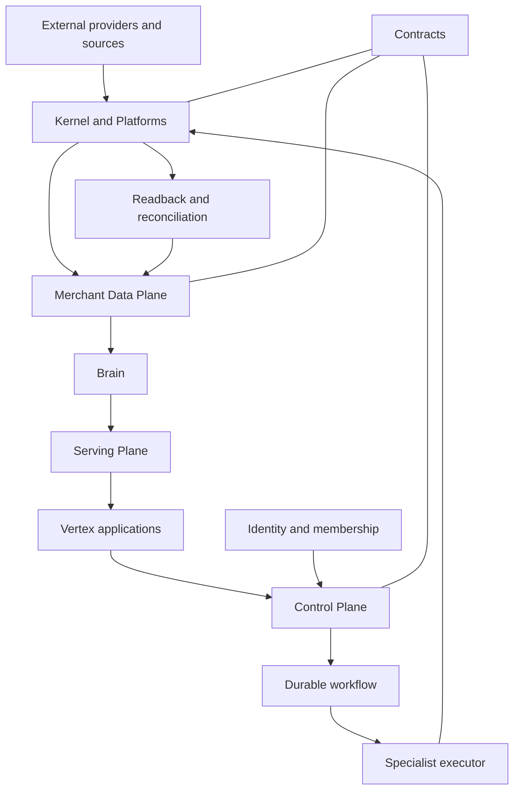

# Vertex system overview diagram source

This safe source diagram accompanies [the system overview](../../architecture/system-overview.md). It is intentionally conceptual.

```mermaid
flowchart TD
  E[External providers and sources] --> K[Kernel and Platforms]
  K --> M[Merchant Data Plane]
  M --> B[Brain]
  B --> S[Serving Plane]
  S --> A[Vertex applications]
  A --> C[Control Plane]
  C --> W[Durable workflow]
  W --> X[Specialist executor]
  X --> K
  K --> R[Readback and reconciliation]
  R --> M
  I[Identity and membership] --> C
  T[Contracts] --- K
  T --- M
  T --- C
```
